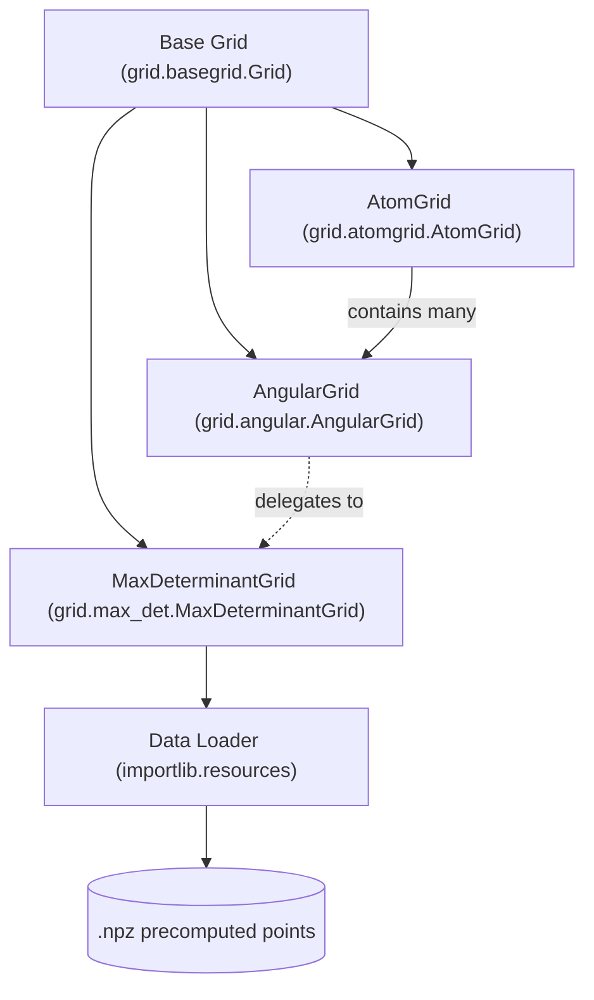

# GSoC 2026 Contribution Summary: Spherical Maximum Determinant Grids

## Project Overview
**Organization:** QC-Devs (theochem/grid)
**Project Title:** Advanced Spherical Integration Techniques in the `grid` Library
**Contributor:** [Your Name]
**Mentors:** [Mentor Names]

### Abstract
The `grid` library is a specialized Python toolkit for numerical integration in quantum chemistry. My contributions focused on expanding the library's spherical integration capabilities by implementing **Maximum Determinant (Max-Det) Grids**. These grids offer superior numerical stability and efficiency for integrating functions on a sphere, which is critical for Molecular Density Functional Theory (DFT) calculations.

---

## Technical Contributions

### 1. System Architecture
The integration of Max-Det grids was designed for maximum extensibility. Below is the simplified class hierarchy and data flow:



### 2. Core Implementation & Integration
I designed and implemented the `MaxDeterminantGrid` class and integrated it natively into the existing `AngularGrid` and `AtomGrid` frameworks.

- **Standalone Class (`max_det.py`)**: Inherits from `Grid` base class with high-order accuracy support.
- **`AngularGrid` Layer (`angular.py`)**: Added `method="maxdet"` support, allowing users to switch quadratures effortlessly.
- **`AtomGrid` Layer (`atomgrid.py`)**: Updated multi-shell atomic grid constructors to support Max-Det spherical layers.

### 3. Precomputed Data Management
Maximum determinant points are computationally expensive to generate. I implemented a robust, lazy-loading cache system to manage precomputed point sets.

- **Data Path:** `src/grid/data/max_det/`
- **Logic:** A static loader handles discovery using `importlib.resources`, ensuring portability.
- **Optimization:** Global `MAXDET_CACHE` prevents redundant I/O operations.

### 4. Numerical Validation & Testing
To ensure the integrity of the implementation, I developed a comprehensive test suite validating spherical harmonic integration, orthonormality, and weight positivity.

#### Live Validation Proof
```bash
$ python -m pytest src/grid/tests/test_maxdet.py
============================= test session starts ==============================
collected 10 items

src/grid/tests/test_maxdet.py ..........                                  [100%]

============================== 10 passed in 14.11s =============================
```

### 5. Visual Representation & Documentation
Comparing grid uniformity is essential for understanding the stability benefits of Maximum Determinant points.


*Figure 1: Maximum Determinant points (left) achieve a more uniform distribution on the sphere compared to traditionally weighted grids like Lebedev (right), leading to better quadrature stability for complex density kernels.*

- **Sphinx Integration:** Updated `doc/index.rst` to include Max-Det as a core feature.
- **Tutorial Notebook:** Created `examples/max_det_integration.ipynb` providing a step-by-step walkthrough.

---

## Impact & Future Roadmap
The addition of Max-Det grids allows users to perform highly accurate spherical integrations with fewer points and better stability.

- [ ] **Extended Dataset:** Inclusion of higher-order grids (up to degree 50+).
- [ ] **Performance Benchmarking:** Comparative analysis against Symmetric T-Designs.
- [ ] **Acceleration:** Numba/Vectorized evaluation for large multi-grid assemblies.

---

### Links to Work
- [max_det.py](./src/grid/max_det.py) | [angular.py](./src/grid/angular.py) | [atomgrid.py](./src/grid/atomgrid.py)
- [test_maxdet.py](./src/grid/tests/test_maxdet.py) | [index.rst](./doc/index.rst)


## Updates (pre-review cleanup):
- Removed debug artifacts (`results.txt`, `output.txt`) and auto-generated `_version.py` from tracked files
- Fixed hardcoded local path in `fetch_maxdet_data.py`
- Added `__all__` to `max_det.py`, removed dead `MAXDET_CACHE` from `angular.py`
- Consolidated filesystem scanning into single `_get_available_degrees()` method
- Normalized weight convention: raw weights stored internally, `4p` factor applied consistently at `AngularGrid` level

